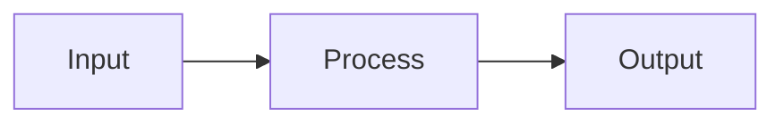

# Fire Enrich - Technical Specifications

## Overview

This directory contains comprehensive technical specifications for the Fire Enrich project. These documents provide detailed information about the system architecture, data models, API contracts, and user workflows.

**Project**: Fire Enrich (fire_clay)
**Version**: 0.1.0
**License**: MIT
**Last Updated**: 2025-10-30

---

## Document Index

### 1. [Project Overview](./project-overview.md)
**Purpose**: High-level project description and strategic vision

**Contents**:
- Project purpose and problem statement
- Solution overview
- Key objectives and success metrics
- Target users and business value
- Current status and roadmap

**Audience**: Stakeholders, new team members, contributors

---

### 2. [Architecture](./architecture.md)
**Purpose**: System architecture and design patterns

**Contents**:
- Architecture overview with diagrams
- Core architectural principles
- Component breakdown (Frontend, API, Business Logic)
- Data flow and agent execution
- Scalability and security considerations
- Technology decisions and rationale

**Audience**: Developers, architects, technical contributors

---

### 3. [API Specification](./api-specification.md)
**Purpose**: Complete API reference and contracts

**Contents**:
- API overview and authentication
- Endpoint documentation:
  - POST `/api/enrich` - Main enrichment endpoint
  - DELETE `/api/enrich` - Cancel enrichment
  - POST `/api/generate-fields` - AI field generation
  - GET `/api/check-env` - Environment validation
- Request/response schemas
- Error codes and handling
- Rate limits and best practices
- SSE streaming protocol

**Audience**: Frontend developers, API consumers, integration engineers

---

### 4. [Agent System](./agent-system.md)
**Purpose**: Multi-agent architecture specification

**Contents**:
- Agent system overview
- Base agent interface and patterns
- Agent catalog (6 specialized agents):
  1. Discovery Agent
  2. Company Profile Agent
  3. Metrics Agent
  4. Funding Agent
  5. Tech Stack Agent
  6. General Purpose Agent
- Agent orchestration and sequencing
- Tools and utilities
- LLM integration
- Extension guide for custom agents

**Audience**: AI/ML developers, agent builders, advanced contributors

---

### 5. [Data Models](./data-models.md)
**Purpose**: Type definitions and data structures

**Contents**:
- Core data models:
  - EmailContext
  - EnrichmentField
  - EnrichmentResult
  - RowEnrichmentResult
  - AgentResult
- Agent-specific schemas
- API request/response models
- SSE event types
- Validation rules
- Type utilities and converters

**Audience**: TypeScript developers, data engineers, QA engineers

---

### 6. [Configuration](./configuration.md)
**Purpose**: Configuration options and deployment guides

**Contents**:
- Environment variables
- API key setup (Firecrawl, OpenAI)
- Application configuration
- Performance tuning
- Security settings
- Deployment guides (Vercel, Docker, Self-hosted)
- Monitoring and logging
- Troubleshooting guide

**Audience**: DevOps, system administrators, deployment engineers

---

### 7. [User Workflows](./user-workflows.md)
**Purpose**: User guide and interaction patterns

**Contents**:
- User journey overview
- Detailed workflows:
  - Basic CSV enrichment
  - Custom field enrichment
  - Large dataset processing
  - API key configuration
- UI components
- Common scenarios (sales, recruiting, research)
- Tips and best practices
- Error handling
- User support and privacy

**Audience**: End users, product managers, UX designers, support team

---

## Quick Navigation

### For Developers

**Getting Started**:
1. [Project Overview](./project-overview.md) - Understand the project
2. [Architecture](./architecture.md) - Learn the system design
3. [Configuration](./configuration.md) - Set up your environment

**Building Features**:
1. [API Specification](./api-specification.md) - Understand endpoints
2. [Data Models](./data-models.md) - Use correct types
3. [Agent System](./agent-system.md) - Extend agent capabilities

### For Users

**Using Fire Enrich**:
1. [Configuration](./configuration.md) - Set up API keys
2. [User Workflows](./user-workflows.md) - Learn how to use the platform
3. [API Specification](./api-specification.md) - Understand data formats

### For Contributors

**Contributing**:
1. [Project Overview](./project-overview.md) - Understand goals
2. [Architecture](./architecture.md) - Learn the codebase structure
3. [Agent System](./agent-system.md) - Build custom agents

---

## Specification Principles

### 1. Completeness
Each specification document aims to provide comprehensive coverage of its domain, minimizing the need to reference code directly.

### 2. Clarity
Technical concepts are explained with examples, diagrams, and practical use cases.

### 3. Maintainability
Specifications are kept in sync with code changes through version control and regular reviews.

### 4. Accessibility
Written for multiple audiences with varying technical backgrounds, from end users to system architects.

---

## Document Conventions

### Code Examples

TypeScript/JavaScript:
```typescript
interface Example {
  field: string;
  value: any;
}
```

JSON:
```json
{
  "field": "example",
  "value": "data"
}
```

Bash/Shell:
```bash
npm install
npm run dev
```

### Diagrams

Mermaid diagrams for architecture and flows:


ASCII diagrams for simple hierarchies:
```
Root
├── Child 1
└── Child 2
```

### File References

- Absolute paths: `/home/user/fire_clay/lib/services/openai.ts`
- Relative paths: `lib/services/openai.ts`
- Line references: `lib/services/openai.ts:42`

### Versioning

- Specifications follow semantic versioning
- Breaking changes documented in changelog
- Version number in document header

---

## Specification Metadata

| Document | Status | Last Updated | Version |
|----------|--------|--------------|---------|
| Project Overview | ✅ Complete | 2025-10-30 | 1.0.0 |
| Architecture | ✅ Complete | 2025-10-30 | 1.0.0 |
| API Specification | ✅ Complete | 2025-10-30 | 1.0.0 |
| Agent System | ✅ Complete | 2025-10-30 | 1.0.0 |
| Data Models | ✅ Complete | 2025-10-30 | 1.0.0 |
| Configuration | ✅ Complete | 2025-10-30 | 1.0.0 |
| User Workflows | ✅ Complete | 2025-10-30 | 1.0.0 |

---

## Key Technical Concepts

### Multi-Agent Architecture
Fire Enrich uses specialized AI agents that execute sequentially, each building on previous context for optimal accuracy.

### Sequential Execution
Agents run in phases (1-6), with each phase providing discovered data to subsequent agents.

### Server-Sent Events (SSE)
Real-time streaming protocol for live enrichment updates from server to client.

### Type Safety
Zod schemas provide runtime validation and TypeScript type inference.

### Progressive Enhancement
Discovery Agent establishes foundation, subsequent agents build upon it.

---

## Technology Stack Summary

### Frontend
- **Framework**: Next.js 15 with App Router
- **UI Library**: React 19
- **Styling**: Tailwind CSS + Radix UI
- **State**: React Hooks
- **Forms**: React Hook Form + Zod

### Backend
- **Runtime**: Node.js 20+
- **Framework**: Next.js API Routes
- **Language**: TypeScript 5
- **Validation**: Zod
- **Streaming**: Server-Sent Events

### AI/ML
- **LLM**: OpenAI GPT-4, Google Gemini (migrating)
- **Web Scraping**: Firecrawl API
- **Structured Output**: Zod schema generation

### Infrastructure
- **Hosting**: Vercel (recommended), Docker, Self-hosted
- **Package Manager**: npm/pnpm
- **Build Tool**: Next.js with Turbopack

---

## Architectural Patterns

### Design Patterns Used

1. **Strategy Pattern**: Enrichment strategies (agent vs. traditional)
2. **Factory Pattern**: Agent creation and selection
3. **Observer Pattern**: SSE for real-time updates
4. **Chain of Responsibility**: Sequential agent execution
5. **Template Method**: Base agent class with overridable methods

### Architectural Styles

1. **Microservices-Inspired**: Separation of concerns across layers
2. **Event-Driven**: SSE streaming and progress updates
3. **Agent-Based**: Specialized autonomous agents
4. **API-First**: Clean REST API contracts
5. **Type-Driven**: TypeScript and Zod throughout

---

## Data Flow Summary

```
CSV Upload (Client)
    ↓
Parse & Validate (Client)
    ↓
POST /api/enrich (SSE Stream)
    ↓
AgentOrchestrator
    ↓
Sequential Agent Execution:
├─ Discovery Agent → Company Identity
├─ Profile Agent → Industry & Business Model
├─ Metrics Agent → Quantitative Data
├─ Funding Agent → Financial Intelligence
├─ Tech Stack Agent → Technical Analysis
└─ General Agent → Custom Fields
    ↓
Final Synthesis (GPT-4/Gemini)
    ↓
Stream Results (SSE Events)
    ↓
UI Updates (Real-time)
    ↓
Download Results (CSV/JSON)
```

---

## Common Questions

### What is Fire Enrich?
An AI-powered data enrichment platform that transforms email lists into comprehensive business intelligence datasets.

### How does the agent system work?
Six specialized agents execute sequentially, each focusing on a specific domain (company identity, industry, metrics, funding, tech stack, custom fields).

### What APIs are required?
Firecrawl (web scraping) and OpenAI (data extraction). Gemini support is in progress.

### How is data validated?
Zod schemas provide runtime validation, TypeScript ensures compile-time type safety, and confidence scores indicate data reliability.

### Can I self-host?
Yes, Fire Enrich is fully open-source and can be deployed on Vercel, Docker, or any Node.js-compatible platform.

### How do I extend with custom agents?
Follow the Agent Extension Guide in [Agent System](./agent-system.md) specification.

---

## Roadmap Highlights

### Current Phase
- ✅ Phase 1: Gemini migration (foundation complete)
- 🔄 Phase 2-5: Gemini integration in progress

### Planned Features
- Multi-LLM provider support
- Caching layer for performance
- Agent marketplace
- Advanced analytics
- Webhook support
- GraphQL API

---

## Contributing to Specifications

### How to Update Specifications

1. **Make Changes**: Edit relevant markdown file
2. **Update Metadata**: Change version and date in document header
3. **Update Index**: Reflect changes in this README
4. **Commit**: Clear commit message describing changes
5. **Review**: Ensure consistency across documents

### Specification Style Guide

- Use clear, concise language
- Provide code examples for technical concepts
- Include diagrams for complex flows
- Keep consistent formatting across documents
- Update table of contents when adding sections

### Review Process

- Specifications reviewed with code changes
- Breaking changes require version bump
- Community feedback incorporated regularly
- Quarterly comprehensive review

---

## Related Documentation

### External Links

- **Main README**: [/README.md](../README.md)
- **API Documentation**: `/api` endpoints self-document via OpenAPI (future)
- **GitHub Repository**: [github.com/mendableai/fire-enrich](https://github.com/mendableai/fire-enrich)
- **Firecrawl Docs**: [docs.firecrawl.dev](https://docs.firecrawl.dev)
- **OpenAI API Docs**: [platform.openai.com/docs](https://platform.openai.com/docs)

### Internal Documentation

- **AI Docs**: [/ai_docs/gemini-migration-phase1-implementation-guide.md](../ai_docs/gemini-migration-phase1-implementation-guide.md)
- **Code Comments**: Inline documentation in source files
- **Type Definitions**: TypeScript `.d.ts` files

---

## Feedback & Support

### Report Issues

- **Specification Errors**: Open issue on GitHub
- **Missing Information**: Request clarification via issues
- **Suggestions**: Submit feature requests

### Contact

- **GitHub Issues**: Bug reports and features
- **Discussions**: Q&A and community support
- **Email**: Check main README for contact info

---

## License

These specifications are part of the Fire Enrich project and are licensed under the MIT License. See [LICENSE](../LICENSE) file for details.

---

## Acknowledgments

Fire Enrich is built with:
- [Firecrawl](https://firecrawl.dev) for web scraping
- [OpenAI](https://openai.com) for AI extraction
- [Next.js](https://nextjs.org) for the framework
- [Vercel](https://vercel.com) for hosting

Special thanks to all contributors and the open-source community.

---

**Last Updated**: 2025-10-30
**Specification Version**: 1.0.0
**Project Version**: 0.1.0
